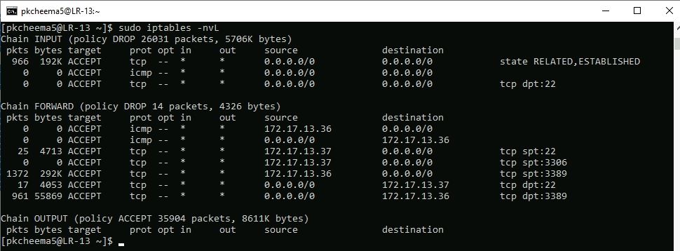
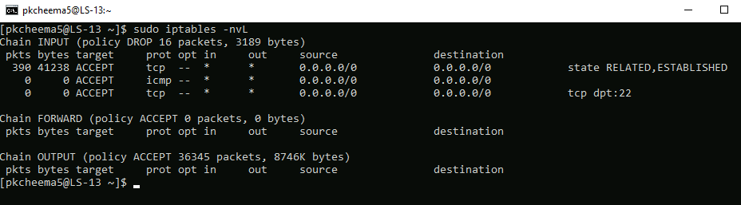

## PreCheckpoint3
 
 * COURSE INFORMATION: CSN400 NAA
 * STUDENT’S NAME: Prabhdeep Kaur Cheema
 * STUDENT'S NUMBER: 13
 * GITHUB USER_ID: myseneca-125823203
 * TEACHER’S NAME: Atoosa Nasiri
 * ASSIGNMENT REF: PreCheckpoint3

## Table Of Contents:
1. [Iptable Firewall Rules for lr13](##Iptable%20firwall%20Rules%20for%lr13)
2. [CP3-lr-firewall-13.sh Script](##CP3-lr-firewall-13.sh%20Script)
3. [Iptable rules listing for lr13](##Iptable%20rules%20listing%20for%lr13)
4. [Iptable rules listing for ls13](##Iptable%20rules%20listing%20for%ls13)

 * Iptable Firewall Rules for lr13
 ```
sudo iptables -F
sudo iptables -X
sudo iptables -P INPUT DROP
sudo iptables -P FORWARD DROP
sudo iptables -A INPUT -p tcp -m state --state ESTABLISHED,RELATED -j ACCEPT
sudo iptables -A INPUT -p icmp -j ACCEPT
sudo iptables -A INPUT -p tcp --dport 22 -j ACCEPT 
sudo iptables -I FORWARD -p tcp -d 172.17.13.36 --dport 3389 -j ACCEPT
sudo iptables -I FORWARD -p tcp -d 172.17.13.37 --dport 22 -j ACCEPT
sudo iptables -I FORWARD -p tcp -s 172.17.13.36 --sport 3389 -j ACCEPT
sudo iptables -I FORWARD -p tcp -s 172.17.13.37 --sport 3306 -j ACCEPT
sudo iptables -I FORWARD -p tcp -s 172.17.13.37 --sport 22 -j ACCEPT
sudo iptables -I FORWARD -p icmp -d 172.17.13.36 -j ACCEPT
sudo iptables -I FORWARD -p icmp -s 172.17.13.36 -j ACCEPT
```

 * CP3-lr-firewall-13.sh Script
```
sudo iptables -F
sudo iptables -X
sudo iptables -P INPUT DROP
sudo iptables -P FORWARD DROP
sudo iptables -A INPUT -p tcp -m state --state ESTABLISHED,RELATED -j ACCEPT
sudo iptables -A INPUT -p icmp -j ACCEPT
sudo iptables -A INPUT -p tcp --dport 22 -j ACCEPT 
sudo iptables -I FORWARD -p tcp -d 172.17.13.36 --dport 3389 -j ACCEPT
sudo iptables -I FORWARD -p tcp -d 172.17.13.37 --dport 22 -j ACCEPT
sudo iptables -I FORWARD -p tcp -s 172.17.13.36 --sport 3389 -j ACCEPT
sudo iptables -I FORWARD -p tcp -s 172.17.13.37 --sport 3306 -j ACCEPT
sudo iptables -I FORWARD -p tcp -s 172.17.13.37 --sport 22 -j ACCEPT
sudo iptables -I FORWARD -p icmp -d 172.17.13.36 -j ACCEPT
sudo iptables -I FORWARD -p icmp -s 172.17.13.36 -j ACCEPT
```

 * Iptable rules listing for lr13

 

 * Iptables rues listing for ls13

 